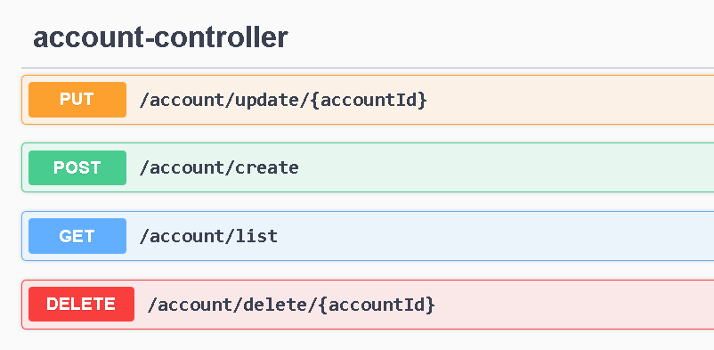
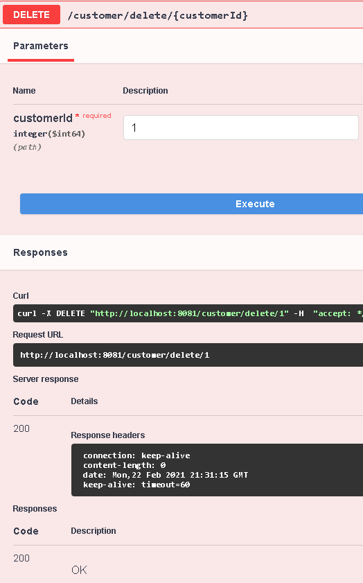

# Fibabanka Java Bootcamp Bitirme Projesi

Bu projede online bankacılık yönetim sisteminin backend servisleri kodlanmıştır. Proje genelinde OOP prensiplerine uyulmuştur. Müşteri, transfer, card ve hesap işlemleri için, oluşturma, güncelleme, silme ve listeleme gibi tüm fonksiyonlar, REST API 'ler aracılığı ile yerine getirilmiştir. API 'ler Swagger arayüzü ile dökümantasyonu yapılmıştır. 
Projede kullanılan teknolojiler: Java, Spring Boot, Spring MVC, Spring Data JPA, Hibernate, Maven, MySQL.

## Fonksiyonlar
* Müşteri yönetimi
* Hesap yönetimi
* Kart yönetimi
* Transfer yönetimi

### Müşteri yönetimi
REST API'lar aracılığı ile; müşteri oluşturma, güncelleme, listeleme ve silme işlemleri gerçekleştirilmiştir. Silme işlemi, hesaplarında parası bulunan ya da kredi kartı borcu bulunan müşteriler için mümkün olmayacak şekilde service kodlaması yapılmıştır.

### Hesap Yönetimi
Banka müşterilerinin yatırımlarını kontrol etmek amacıyla kullanabilmeleri için uygun API'ler kodlanarak hesap oluşturmalarına ve silmelerine izin verilmiştir.

### Transfer Yönetimi
Müşterilerin para transferlerini yönetmek için uygun API'lar sağlanmıştır. Transfer işlemleri hesaptan hesaba başarılı bir şekilde gerçekleştirilmekte ve işlem çıktısı veritabanına kaydedilmektedir.

### REST API Design

Projede uygulanmış olan REST API design aşağıda bulunan görsellerde olduğu şekildedir:

**Figure 1**

**Figure 2**

### Project Package Structure

### Class Diagram

Projede kullanılmış olan 4 temel sınıf şu şekilde oluşturulmuş ve birbirleri ile olan ilişkiler aşağıdaki gibi belirlenmiştir:

### API Endpoints & Data Model

Projedeki API endpointsleri anlamak için, Swagger Editor aşağıdaki bilgileri göster:

API'yi tasarlamak için, orijinal Swagger Spesifikasyonu olarak bilinen OpenAPI spesifikasyonu kullanıldı. OpenAPI Spesifikasyonu dilden bağımsızdır ve şu anda Google ve Microsoft gibi büyük şirketlerin projelerinde kullanılmaktadır. Proje kurulumunu gerçekleştirdikten sonra API 'ye erişmek için http://localhost:8081/ adresini kullanabilirsiniz.

Swagger editörün göstermiş olduğu API Endpoints bilgileri aşağıda belirtilmiştir:

### Figure 1 - **Customer Endpoints** 

### Figure 2 - **Account Endpoints**

### Figure 3 - **Transfer Endpoints**

## SWAGGER TEST

### Customer REST API Oluşturma

HTTP Method: POST

RequestURL: http://localhost:8081/swagger-ui/index.html?configUrl=/v3/api-docs/swagger-config#/customer-controller/createCustomer

### Customer REST API Güncelleme

HTTP Method: PUT

RequestURL: http://localhost:8081/swagger-ui/index.html?configUrl=/v3/api-docs/swagger-config#/customer-controller/updateCustomer

### Customer REST API Listeleme

HTTP Method: GET

RequestURL: http://localhost:8081/swagger-ui/index.html?configUrl=/v3/api-docs/swagger-config#/customer-controller/listAllCustomers

### Customer REST API Silme

HTTP Method: DELETE

RequestURL: http://localhost:8081/swagger-ui/index.html?configUrl=/v3/api-docs/swagger-config#/customer-controller/deleteCustomer

